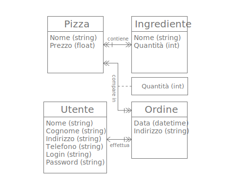
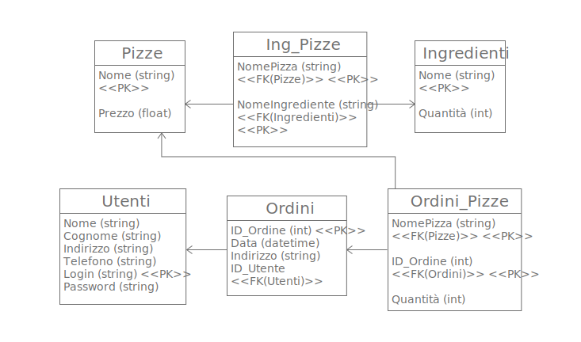
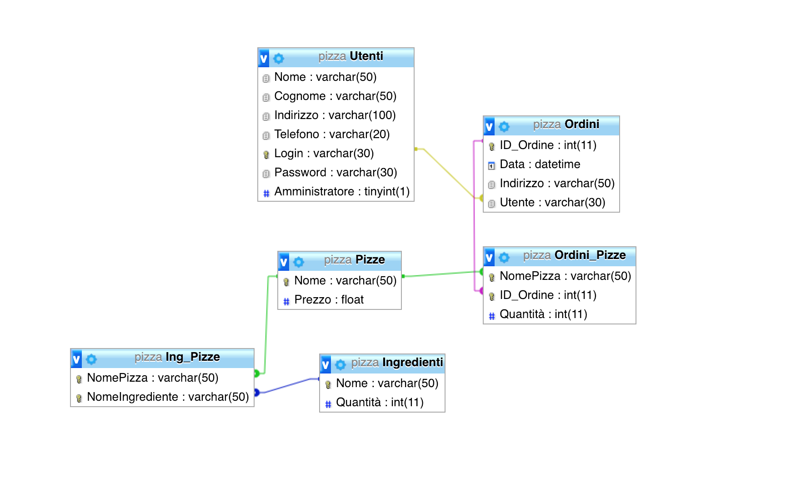

# Progetto di Basi di Dati - 2018

[TOC]

## Introduzione

Andremo a descrivere la realizzazione di un mini gestionale, il quale consenta di gestire gli ordini, il catalogo e l'inventario di una pizzeria.

Il software sarà fruibile da più utenti via Web. Gli utenti saranno sia clienti che personale della pizzeria, consentendo ordini online.

Il sistema del software sarà composto da varie parti:

- Una **Base Dati** che gestisca la persistenza, usando *MariaDB*
- Un **Backend**, scritto in *PHP* usando *Slim*, che esponga delle *REST API* per la manipolazione della base dati
- Un **Frontend Single Page Application**, realizzata con *React*

## Descrizione Base Dati

### Modello ad Oggetti



### Modello Relazionale





### Codice Generazione Schema Database

```sql
SET SQL_MODE = "NO_AUTO_VALUE_ON_ZERO";
SET time_zone = "+00:00";

--
-- Database: `pizza`
--

-- --------------------------------------------------------

--
-- Struttura della tabella `Ingredienti`
--

CREATE TABLE `Ingredienti` (
  `Nome` varchar(50) NOT NULL,
  `Quantità` int(11) NOT NULL DEFAULT '0'
) ENGINE=InnoDB DEFAULT CHARSET=utf8mb4;

-- --------------------------------------------------------

--
-- Struttura della tabella `Ing_Pizze`
--

CREATE TABLE `Ing_Pizze` (
  `NomePizza` varchar(50) NOT NULL,
  `NomeIngrediente` varchar(50) NOT NULL
) ENGINE=InnoDB DEFAULT CHARSET=utf8mb4;

-- --------------------------------------------------------

--
-- Struttura della tabella `Ordini`
--

CREATE TABLE `Ordini` (
  `ID_Ordine` int(11) NOT NULL,
  `Data` datetime NOT NULL,
  `Indirizzo` varchar(50) NOT NULL,
  `Utente` varchar(30) NOT NULL
) ENGINE=InnoDB DEFAULT CHARSET=utf8mb4;

-- --------------------------------------------------------

--
-- Struttura della tabella `Ordini_Pizze`
--

CREATE TABLE `Ordini_Pizze` (
  `NomePizza` varchar(50) NOT NULL,
  `ID_Ordine` int(11) NOT NULL,
  `Quantità` int(11) NOT NULL DEFAULT '0'
) ENGINE=InnoDB DEFAULT CHARSET=utf8mb4;

-- --------------------------------------------------------

--
-- Struttura della tabella `Pizze`
--

CREATE TABLE `Pizze` (
  `Nome` varchar(50) NOT NULL,
  `Prezzo` float NOT NULL DEFAULT '0'
) ENGINE=InnoDB DEFAULT CHARSET=utf8mb4;

-- --------------------------------------------------------

--
-- Struttura della tabella `Utenti`
--

CREATE TABLE `Utenti` (
  `Nome` varchar(50) NOT NULL,
  `Cognome` varchar(50) NOT NULL,
  `Indirizzo` varchar(100) NOT NULL,
  `Telefono` varchar(20) NOT NULL,
  `Login` varchar(30) NOT NULL,
  `Password` varchar(30) NOT NULL,
  `Amministratore` tinyint(1) NOT NULL DEFAULT '0'
) ENGINE=InnoDB DEFAULT CHARSET=utf8mb4;

--
-- Dump dei dati per la tabella `Utenti`
--

INSERT INTO `Utenti` (`Nome`, `Cognome`, `Indirizzo`, `Telefono`, `Login`, `Password`, `Amministratore`) VALUES
('Utente', 'Amministratore', 'via Torino 42, Mestre', '000000000', 'admin', 'admin', 1);

--
-- Indici per le tabelle scaricate
--

--
-- Indici per le tabelle `Ingredienti`
--
ALTER TABLE `Ingredienti`
  ADD PRIMARY KEY (`Nome`);

--
-- Indici per le tabelle `Ing_Pizze`
--
ALTER TABLE `Ing_Pizze`
  ADD PRIMARY KEY (`NomePizza`,`NomeIngrediente`),
  ADD KEY `Ing_Pizze_ibfk_2` (`NomeIngrediente`);

--
-- Indici per le tabelle `Ordini`
--
ALTER TABLE `Ordini`
  ADD PRIMARY KEY (`ID_Ordine`),
  ADD KEY `Ordini_ibfk_1` (`Utente`);

--
-- Indici per le tabelle `Ordini_Pizze`
--
ALTER TABLE `Ordini_Pizze`
  ADD PRIMARY KEY (`NomePizza`,`ID_Ordine`),
  ADD KEY `ID_Ordine` (`ID_Ordine`);

--
-- Indici per le tabelle `Pizze`
--
ALTER TABLE `Pizze`
  ADD PRIMARY KEY (`Nome`);

--
-- Indici per le tabelle `Utenti`
--
ALTER TABLE `Utenti`
  ADD PRIMARY KEY (`Login`);

--
-- AUTO_INCREMENT per le tabelle scaricate
--

--
-- AUTO_INCREMENT per la tabella `Ordini`
--
ALTER TABLE `Ordini`
  MODIFY `ID_Ordine` int(11) NOT NULL AUTO_INCREMENT;
--
-- Limiti per le tabelle scaricate
--

--
-- Limiti per la tabella `Ing_Pizze`
--
ALTER TABLE `Ing_Pizze`
  ADD CONSTRAINT `Ing_Pizze_ibfk_1` FOREIGN KEY (`NomePizza`) REFERENCES `Pizze` (`Nome`) ON DELETE CASCADE ON UPDATE CASCADE,
  ADD CONSTRAINT `Ing_Pizze_ibfk_2` FOREIGN KEY (`NomeIngrediente`) REFERENCES `Ingredienti` (`Nome`) ON DELETE CASCADE ON UPDATE CASCADE;

--
-- Limiti per la tabella `Ordini`
--
ALTER TABLE `Ordini`
  ADD CONSTRAINT `Ordini_ibfk_1` FOREIGN KEY (`Utente`) REFERENCES `Utenti` (`Login`) ON DELETE CASCADE ON UPDATE CASCADE;

--
-- Limiti per la tabella `Ordini_Pizze`
--
ALTER TABLE `Ordini_Pizze`
  ADD CONSTRAINT `Ordini_Pizze_ibfk_1` FOREIGN KEY (`NomePizza`) REFERENCES `Pizze` (`Nome`) ON DELETE CASCADE ON UPDATE CASCADE,
  ADD CONSTRAINT `Ordini_Pizze_ibfk_2` FOREIGN KEY (`ID_Ordine`) REFERENCES `Ordini` (`ID_Ordine`) ON DELETE CASCADE ON UPDATE CASCADE;


```